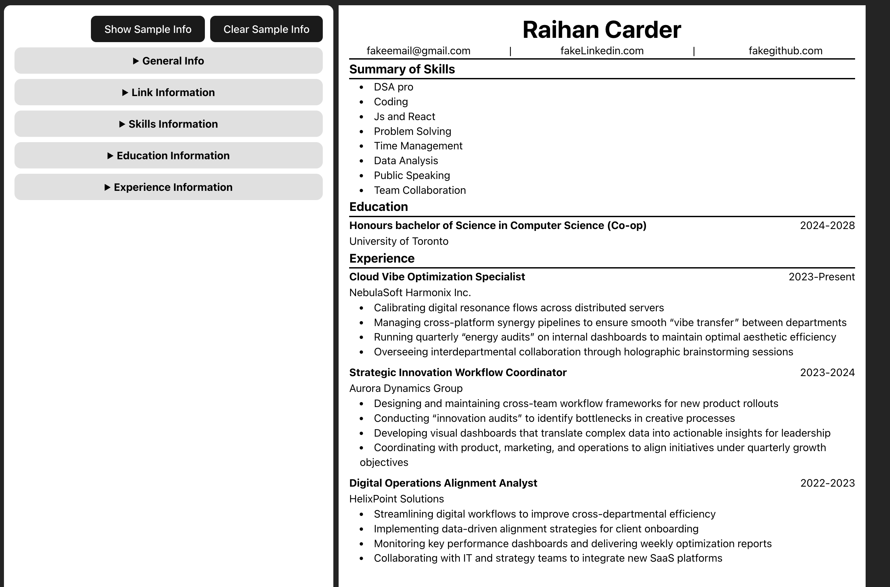
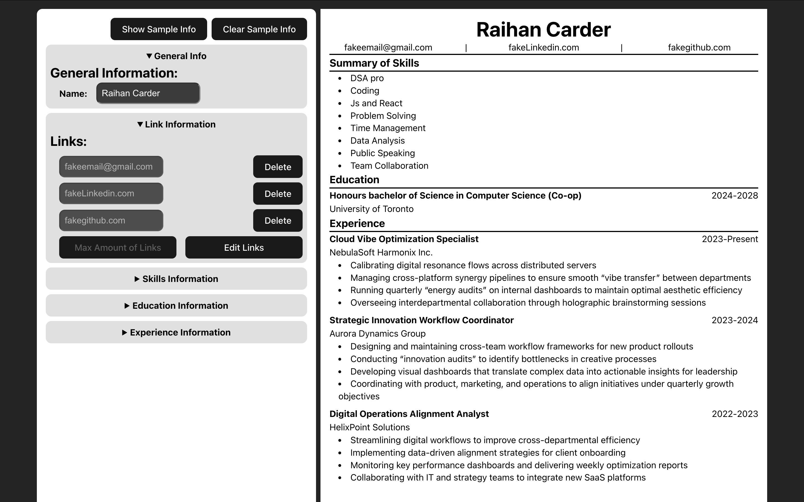

# Resume Builder

A Modern Web App to Create, Edit, and Export Resumes in Real-Time.

This project I focused on learning React and on building a **scalable React application** with modular components, form handling, and dynamic sections — designed with an emphasis on clean UI/UX and practical usability.

## Features

- Add, Edit, and Delete Resume Sections (General Info, Links, Skills, Education, Experience)
- Manage Tasks for each Experience dynamically
- Live Preview of your resume while editing
- Collapsible editor sections for clean organization
- Export-ready format (easy to extend for PDF/print)
- Responsive and Simple UI

## Live Demo

👉 [View Demo](https://resumebuilder-sepia-pi.vercel.app/)

## Screenshots

## Prerequisites

- [Node.js](https://nodejs.org/) (v16 or higher recommended)
- npm (comes with Node)

## Installation

1. git clone https://github.com/your-username/resume-builder.git
2. cd resume-builder
3. npm install
4. npm run dev
5. Open @ http://localhost:5173 in browser (if using vite)

## Tech Stack

- React.js

Created by Raihan Carder (https://github.com/raihanCarder)
Feel free to reach out!
